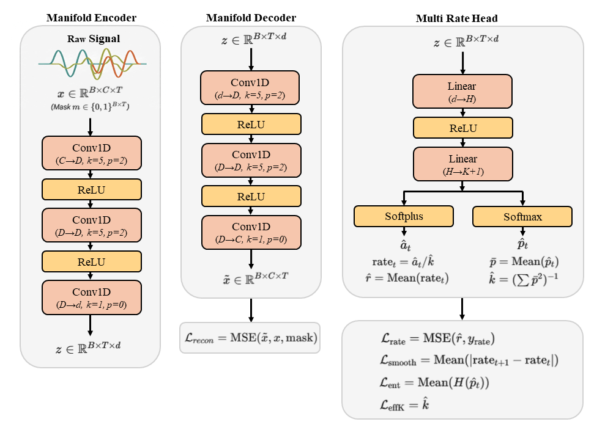

# Resource-Efficient Repetition Counting at the Edge: A Weakly Supervised Framework for IoT Wearables via Window-Stabilized Rate Learning


<p align="center"></p>

This repository implements the methodology proposed in the paper "Resource-Efficient Repetition Counting at the Edge: A Weakly Supervised Framework for IoT Wearables via Window-Stabilized Rate Learning".


## Paper Overview
**Abstract**: With the proliferation of IoT-enabled wearable
devices, on-device activity quantification has become critical
for reducing transmission bandwidth and ensuring real-time
feedback. However, deploying robust models on edge devices
faces a bottleneck: the scarcity of fine-grained annotations in
massive-scale user data, rehabilitation assessment, and sensorcentric
IoT analytics. However, most existing repetition counting
approaches either depend on densely annotated repetition
boundaries or treat count-only supervision as terminal regression
using trial-level totals, creating an ill-conditioned learning setup
that pairs a long multivariate sequence with a single scalar.
Consequently, counting accuracy often degrades under realistic
sensing conditions where execution tempo, user style, and sensor
placement vary, particularly when fine-grained annotations are
unavailable.We propose window-stabilized rate learning, a countonly
weakly supervised framework that leverages trial-level
totals beyond terminal regression. The key idea is to reinterpret
the trial-level count as a rate-based supervisory anchor and
propagate it to overlapping temporal windows during training,
providing a consistent learning signal without requiring repetition
boundaries. Building on this stabilized supervision, we explicitly
represent periodic structure by factorizing repetitive motion
into a nonnegative, time-varying micro-rate capturing instantaneous
repetition intensity and a phase distribution modeling
progression within a cycle. Repetition counts are recovered
through a structured aggregation process, yielding interpretable
intermediate quantities such as window-level rate profiles and
phase usage. Experiments on multiple public wearable inertial
sensing benchmarks show improved counting robustness under
subject shifts. Under time-warped testing, the method prioritizes
preserving a stable phase-structured representation; although
count-only supervision limits instantaneous rate adaptation, this
structural stability reduces reliance on signal magnitude and
mitigates the unbounded error accumulation often observed in
energy-based integrators. Overall, the proposed method improves
robustness to tempo variations while remaining compatible with
coarse session logs, offering an effective and interpretable solution
for weakly supervised repetition counting in practical wearable
IoT scenarios.

## Dataset
- **MHEALTH** dataset is available at _https://archive.ics.uci.edu/dataset/319/mhealth+dataset_
- **MM-Fit** dataset is available at _https://mmfit.github.io/_

## Requirements
```
torch==2.5.0+cu126
numpy==2.0.2
pandas==2.2.2
scikit-learn==1.6.1
matplotlib==3.10.0
seaborn==0.13.2
fvcore==0.1.5.post20221221
```
To install all required packages:
```
pip install -r requirements.txt
```

## Codebase Overview
- `model.py` - Implementation of the proposed **count-only weakly supervised** framework.
The implementation uses PyTorch, Numpy, pandas, scikit-learn, matplotlib, seaborn, and fvcore (for FLOPs analysis).

## Citing this Repository

If you use this code in your research, please cite:

```
@article{Resource-Efficient Repetition Counting at the Edge: A Weakly Supervised Framework for IoT Wearables via Window-Stabilized Rate Learning},
  title = {Resource-Efficient Repetition Counting at the Edge: A Weakly Supervised Framework for IoT Wearables via Window-Stabilized Rate Learning},
  author={JunYoung Park and Myung-Kyu Yi}
  journal={},
  volume={},
  Issue={},
  pages={},
  year={}
  publisher={}
}
```

## Contact

For questions or issues, please contact:
- JunYoung Park : park91802@gmail.com

## License

This project is licensed under the MIT License - see the [LICENSE](LICENSE) file for details.
